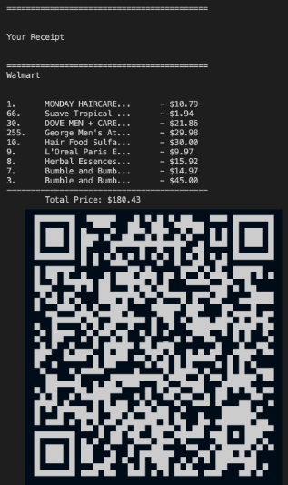
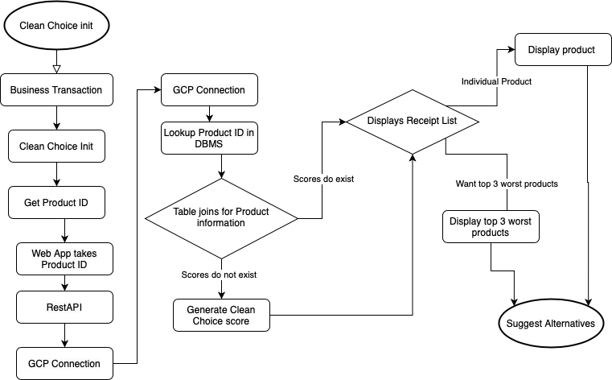

### Project Links

[Github Repo - CleanChoice](https://github.com/Christophler/CleanChoice)

### Context

CleanChoice was developed by myself and three others, as a hackathon project around sustainability and everyday decision-making. The project aimed to make cleaner or more environmentally responsible choices easier to discover and act on by incorporating QR codes on merchandise receipts. Customers would be able to scan and view the environmental impact of their purchases and discover more eco-friendly alternatives.

*What a receipt incorporated with CleanChoice could look like.*

### Role

Helped turn the sustainability concept into an interactive prototype, focusing on communicating recommendations or information in a straightforward user experience.

### Architecture

*High-level flow from the CleanChoice UI through recommendation logic.*

### Implementation

- Web scraped product information from Walmart and Amazon using Python scripts.
- Implemented GCP for running a Node.JS app on a GCP VM as well as GCP SQL for the DBMS of the application.
- Used DitchCarbon and climclimatiq APIs for calculating environmental friendliness scores based on carbon emissions used in production and shipping, respectively.

> **Decision:** Present sustainability as a set of practical choices rather than an abstract topic, making the prototype immediately useful to its intended audience.

### Outcome

- Won 2nd place overall & Best UI/UX
- Produced a sustainability-focused hackathon prototype.
- Practiced translating a social-impact idea into an interactive product.
- Strengthened skills in rapid prototyping, frontend development, and communicating recommendations.

### What I'd improve

- Support evidence-backed recommendations with transparent sources.
- Add personalization based on location, budget, and lifestyle.
- Measure user actions rather than only displaying information.
- Improve accessibility, mobile responsiveness, and content updates.
- Implement a point/rewards system for consumers.
